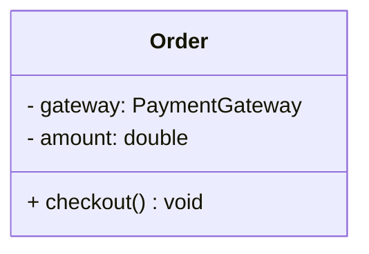
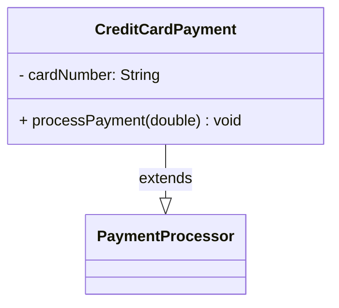
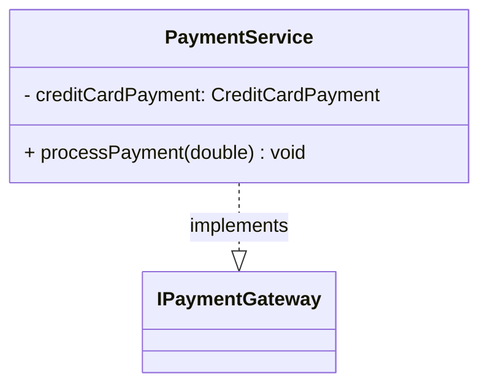

# Java UML Generator 🎨

A command-line tool that analyzes Java source code and automatically generates UML class diagrams in multiple formats (Mermaid, PlantUML, and text).

**Status**: Phase 3 Complete ✅ - Ready for production use

## Features

✨ **Automatic UML Extraction**
- Parse Java source files using JavaParser
- Extract class, interface, enum, and annotation definitions
- Detect inheritance relationships (`extends`)
- Detect interface implementations (`implements`)

📊 **Multiple Output Formats**
- **Text**: Human-readable class information
- **Mermaid**: GitHub-compatible diagram syntax
- **PlantUML**: Professional UML diagram syntax

🎯 **Class Information Extracted**
- Class name and package
- Class type (class, interface, enum, annotation)
- All fields with visibility and types
- All methods with parameters and return types
- Inheritance and implementation relationships

## Quick Start

### Prerequisites
- Java 25+
- Maven 3.9+
- Windows (PowerShell scripts provided)

### Installation

1. Clone the repository:
```bash
git clone https://github.com/your-repo/java-uml-generator.git
cd java-uml-generator
```

2. Build the project:
```bash
mvn clean compile
```

### Usage

#### Text Output (Default)
```powershell
.\run-uml.ps1 src/samples/Order.java
```

#### Mermaid Diagram
```powershell
.\run-uml-diagram.ps1 src/samples/CreditCardPayment.java mermaid
```

#### PlantUML Diagram
```powershell
.\run-uml-diagram.ps1 src/samples/CreditCardPayment.java plantuml
```

#### Or directly with Java
```powershell
$repo = "$env:USERPROFILE\.m2\repository"
$cp = "target\classes;$repo\com\github\javaparser\javaparser-core\3.25.9\javaparser-core-3.25.9.jar"
java -cp $cp com.deepak.uml.Main src/samples/CreditCardPayment.java --format mermaid
```

## Examples

### Example 1: Simple Class

**Input**: `Order.java`
```java
package com.example;

public class Order {
    private PaymentGateway gateway;
    private double amount;

    public Order(PaymentGateway gateway) {
        this.gateway = gateway;
    }

    public void checkout() {
        gateway.processPayment(100.0);
    }
}
```

**Output (Mermaid)**:


### Example 2: Inheritance

**Input**: `CreditCardPayment.java`
```java
public class CreditCardPayment extends PaymentProcessor {
    private String cardNumber;

    @Override
    public void processPayment(double amount) {
        // implementation
    }
}
```

**Output (Mermaid)**:


### Example 3: Interface Implementation

**Input**: `PaymentService.java`
```java
public class PaymentService implements IPaymentGateway {
    private CreditCardPayment creditCardPayment;

    @Override
    public void processPayment(double amount) {
        // implementation
    }
}
```

**Output (Mermaid)**:


## Project Structure

```
java-uml-generator/
├── src/main/java/com/deepak/uml/
│   ├── Main.java                 # Entry point
│   ├── parser/
│   │   └── JavaSourceParser.java # Parses .java files using JavaParser
│   ├── analyzer/
│   │   └── ClassAnalyzer.java    # Extracts UML information from AST
│   ├── generator/
│   │   ├── DiagramGenerator.java      # Interface for generators
│   │   ├── MermaidGenerator.java      # Generates Mermaid syntax
│   │   └── PlantUMLGenerator.java     # Generates PlantUML syntax
│   └── model/
│       ├── UmlClass.java         # Represents a class/interface
│       ├── UmlField.java         # Represents a field
│       ├── UmlMethod.java        # Represents a method
│       ├── UmlParameter.java     # Represents a method parameter
│       ├── UmlRelationship.java  # Represents relationships
│       ├── ClassType.java        # Enum: CLASS, INTERFACE, ENUM, ANNOTATION
│       ├── RelationshipType.java # Enum: INHERITANCE, IMPLEMENTATION
│       └── Visibility.java       # Enum: PUBLIC, PRIVATE, PROTECTED, PACKAGE
├── src/samples/                  # Sample Java files for testing
├── samples_diagrams/             # Generated diagram examples
├── pom.xml                       # Maven configuration
├── run-uml.ps1                   # Script for text output
├── run-uml-diagram.ps1           # Script for diagram output
├── PHASE2_SUMMARY.md             # Phase 2 (Relationships) documentation
├── PHASE3_SUMMARY.md             # Phase 3 (Diagrams) documentation
└── README.md                     # This file
```

## Architecture

### Data Flow

```
Java Source Code
        ↓
JavaSourceParser (JavaParser library)
        ↓
AST (Abstract Syntax Tree)
        ↓
ClassAnalyzer (Extract UML information)
        ↓
UML Model (UmlClass, UmlField, UmlMethod, etc.)
        ↓
DiagramGenerator (Mermaid, PlantUML, etc.)
        ↓
Diagram Syntax / Text Output
        ↓
Display or Save to File
```

### Key Classes

- **UmlClass**: Container for class information (name, package, type, fields, methods, relationships)
- **ClassAnalyzer**: Walks the JavaParser AST and extracts UML information
- **DiagramGenerator**: Interface for different output formats
- **MermaidGenerator**: Converts UML model to Mermaid syntax (GitHub-compatible)
- **PlantUMLGenerator**: Converts UML model to PlantUML syntax

## Visibility Symbols

| Symbol | Meaning | Example |
|--------|---------|---------|
| `+` | Public | `+ checkout() void` |
| `-` | Private | `- amount: double` |
| `#` | Protected | `# processingFee: double` |
| `~` | Package | `~ validateCard() boolean` |

## Relationship Notation

| Arrow | Meaning | Example |
|-------|---------|---------|
| `--|>` | Inheritance | `CreditCard --|> PaymentProcessor` |
| `..\|>` | Implementation | `PaymentService ..\|> IPaymentGateway` |

## Dependencies

- **JavaParser 3.25.9**: AST parsing and analysis
- **Java 25+**: Modern Java features

See `pom.xml` for complete dependency list.

## Roadmap

### ✅ Completed
- [x] Phase 1: Parse Java files and extract basic class information
- [x] Phase 2: Detect inheritance and interface relationships
- [x] Phase 3: Generate Mermaid and PlantUML diagrams

### 🚧 Planned
- [ ] Phase 4: Dependency detection (field type analysis for "uses" relationships)
- [ ] Phase 5: Composition vs Association classification
- [ ] Phase 6: Support for generic types and array types
- [ ] Phase 7: Nested class visualization
- [ ] Phase 8: Batch processing and file export
- [ ] Phase 9: VS Code extension
- [ ] Phase 10: IntelliJ IDEA plugin

## How to Generate Diagrams for GitHub

1. Generate Mermaid diagram:
```powershell
.\run-uml-diagram.ps1 src/samples/CreditCardPayment.java mermaid > diagram.md
```

2. Copy output to your README:
```markdown
## Class Diagram

```mermaid
[paste diagram content here]
```
```

3. Push to GitHub - it will automatically render!

## Building and Running

### Build
```bash
mvn clean compile
```

### Run
```bash
# Text format
.\run-uml.ps1 src/samples/Order.java

# Mermaid format
.\run-uml-diagram.ps1 src/samples/CreditCardPayment.java mermaid

# PlantUML format
.\run-uml-diagram.ps1 src/samples/PaymentService.java plantuml
```

## Testing

Sample test files are provided in `src/samples/`:
- `Order.java` - Simple class
- `PaymentGateway.java` - Abstract base class
- `CreditCardPayment.java` - Class with inheritance
- `IPaymentGateway.java` - Interface
- `PaymentService.java` - Class implementing interface

Run on any of these to see the tool in action.

## Limitations

Currently **not supported**:
- Dependency detection (field types → uses relationships)
- Generic types (List<T>, Map<K,V>)
- Array types (String[], int[])
- Nested/inner classes
- Static members
- Composition vs Association classification
- Multiplicity indicators
- Automatic file export

## Contributing

Contributions welcome! Areas for improvement:
- Support for more Java language features
- Additional diagram formats (SVG, PNG, etc.)
- Performance optimizations
- Extended documentation
- More comprehensive test suite

## License

MIT License - feel free to use this tool in your projects!

## Author

Deepak - Java UML Generator Project

---

**Happy diagramming!** 📊✨

For detailed information about each phase:
- See [PHASE2_SUMMARY.md](docs/PHASE2_SUMMARY.md) for relationship detection
- See [PHASE3_SUMMARY.md](docs/PHASE3_SUMMARY.md) for diagram generation
