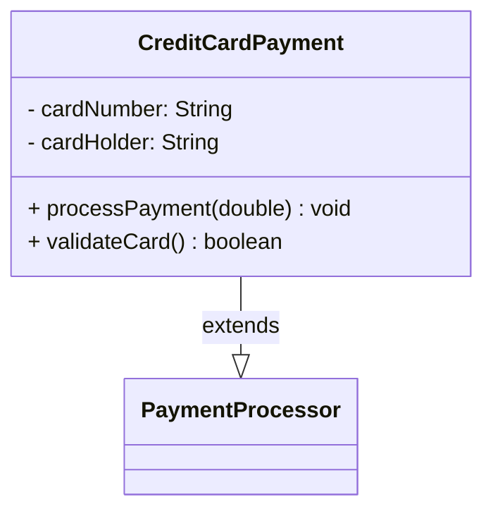

# Java UML Generator - Complete Summary

**Project Status**: Phase 3 Complete ✅ - Ready for Production

Date: 2026-08-22  
Version: 1.0-SNAPSHOT

---

## 🎉 What We've Built

A complete **Java UML Generator** tool that:

1. ✅ **Parses Java source code** using JavaParser
2. ✅ **Extracts class information**:
   - Class, interface, enum, annotation types
   - Fields with visibility and types
   - Methods with parameters and return types
3. ✅ **Detects relationships**:
   - Inheritance (extends)
   - Interface implementation (implements)
4. ✅ **Generates diagrams** in multiple formats:
   - Text (human-readable)
   - Mermaid (GitHub-compatible)
   - PlantUML (professional UML)

---

## 📊 Project Structure

### Phase 1: Core Parsing (Complete)
```
Java Source Code
    → JavaSourceParser (uses JavaParser library)
    → AST
    → ClassAnalyzer
    → UML Model Objects
    → Text Output
```

**Files**: JavaSourceParser.java, ClassAnalyzer.java, UmlClass.java, etc.

### Phase 2: Relationship Detection (Complete)
```
UML Model Objects
    → Extract extends relationships
    → Extract implements relationships
    → Enhanced Output with Relationships
    → Text output shows relationships
```

**Files**: UmlRelationship.java, RelationshipType.java, Updated ClassAnalyzer.java

### Phase 3: Diagram Generation (Complete)
```
UML Model Objects
    → DiagramGenerator Interface
        ├─ MermaidGenerator
        ├─ PlantUMLGenerator
        └─ Text Formatter
    → Diagram Syntax
    → Rendered in GitHub / Documentation Tools
```

**Files**: DiagramGenerator.java, MermaidGenerator.java, PlantUMLGenerator.java

---

## 📁 Key Files Created

### Model Classes (`src/main/java/com/deepak/uml/model/`)
- `UmlClass.java` - Represents a complete class/interface with fields, methods, relationships
- `UmlField.java` - Represents a field with visibility
- `UmlMethod.java` - Represents a method with parameters
- `UmlParameter.java` - Represents a method parameter
- `UmlRelationship.java` - Represents class relationships
- `ClassType.java` - Enum: CLASS, INTERFACE, ENUM, ANNOTATION
- `RelationshipType.java` - Enum: INHERITANCE, IMPLEMENTATION
- `Visibility.java` - Enum: PUBLIC, PRIVATE, PROTECTED, PACKAGE

### Core Logic
- `JavaSourceParser.java` - Parses .java files using JavaParser
- `ClassAnalyzer.java` - Walks AST and extracts UML information

### Diagram Generators
- `DiagramGenerator.java` - Interface for diagram generators
- `MermaidGenerator.java` - Generates Mermaid class diagram syntax
- `PlantUMLGenerator.java` - Generates PlantUML class diagram syntax

### Entry Point
- `Main.java` - CLI with `--format` option for output selection

### Utilities
- `run-uml.ps1` - PowerShell script for text output
- `run-uml-diagram.ps1` - PowerShell script for diagram output

### Documentation
- `README.md` - Complete project documentation
- `PHASE2_SUMMARY.md` - Phase 2 detailed documentation
- `PHASE3_SUMMARY.md` - Phase 3 detailed documentation
- `SAMPLE_DIAGRAMS.md` - Example diagrams and usage

---

## 🎯 How to Use

### Basic Usage

```bash
# Navigate to project directory
cd java-uml-generator

# Build (first time only)
mvn clean compile

# Generate text output
.\run-uml.ps1 src/samples/Order.java

# Generate Mermaid diagram
.\run-uml-diagram.ps1 src/samples/CreditCardPayment.java mermaid

# Generate PlantUML diagram
.\run-uml-diagram.ps1 src/samples/PaymentService.java plantuml
```

### Command Line Options

```
Usage: java Main <path-to-java-file> [--format <format>]

Formats:
  text      - Human-readable text output (default)
  mermaid   - Mermaid class diagram syntax (GitHub-compatible)
  plantuml  - PlantUML class diagram syntax (professional UML)

Examples:
  java Main src/samples/Order.java
  java Main src/samples/Order.java --format mermaid
  java Main src/samples/Order.java --format plantuml
```

---

## 📊 Example Output

### Input Java File
```java
public class CreditCardPayment extends PaymentProcessor {
    private String cardNumber;
    private String cardHolder;

    @Override
    public void processPayment(double amount) {
        double total = calculateTotal(amount);
    }

    public boolean validateCard() {
        return cardNumber != null && cardNumber.length() == 16;
    }
}
```

### Text Format Output
```
Class: CreditCardPayment
Package: com.example
Type: CLASS

Relationships:
  CreditCardPayment extends PaymentProcessor

Fields:
  - cardNumber : String
  - cardHolder : String

Methods:
  + processPayment(amount : double) : void
  + validateCard() : boolean
```

### Mermaid Diagram Output


### PlantUML Output
```
@startuml
!theme plain
class CreditCardPayment {
    - cardNumber: String
    - cardHolder: String
    --
    + processPayment(amount: double): void
    + validateCard(): boolean
}

CreditCardPayment --|> PaymentProcessor
@enduml
```

---

## 🔧 Technical Stack

- **Language**: Java 25
- **Build Tool**: Maven 3.9+
- **AST Parser**: JavaParser 3.25.9
- **Design Patterns**:
  - Strategy Pattern (DiagramGenerator implementations)
  - Visitor Pattern (AST traversal)
  - Model-View separation

---

## ✨ Features

### ✅ Implemented
- ✅ Parse Java source files
- ✅ Extract class definitions
- ✅ Extract fields (with visibility)
- ✅ Extract methods (with parameters and return types)
- ✅ Detect inheritance relationships (extends)
- ✅ Detect interface implementations (implements)
- ✅ Support for interfaces, enums, annotations
- ✅ Multiple output formats (text, Mermaid, PlantUML)
- ✅ Command-line interface with options

### ❌ Not Yet Implemented
- ❌ Dependency detection (field type analysis)
- ❌ Composition vs Association classification
- ❌ Generic types (List<T>, Map<K,V>)
- ❌ Array types (String[], int[])
- ❌ Nested/inner classes
- ❌ Static member notation
- ❌ Multiplicity indicators
- ❌ Batch file processing
- ❌ Automatic file export
- ❌ VS Code extension
- ❌ IntelliJ plugin

---

## 🚀 Next Steps (Future Phases)

### Phase 4: Dependency Detection
Analyze field types to detect "uses" relationships:
```
PaymentService has field: CreditCardPayment creditCardPayment
→ Creates dependency: PaymentService ---> CreditCardPayment
```

### Phase 5: Type Enhancement
Support for complex Java types:
- Generic types: `List<PaymentProcessor>`, `Map<String, Order>`
- Array types: `PaymentProcessor[]`
- Wildcards: `List<? extends PaymentProcessor>`

### Phase 6: Nested Classes
Support for inner and static nested classes

### Phase 7: Advanced Features
- Static member markers
- Multiplicity (1, *, 0..1, 1..*)
- Abstract class notation
- Composition vs Association visualization

### Phase 8: Export Enhancement
- Batch processing multiple files
- Auto-save diagrams to files
- Generate complete system diagrams
- Diagram customization (colors, styling)

### Phase 9: IDE Integration
- VS Code extension
- IntelliJ IDEA plugin
- Real-time diagram preview

---

## 💻 Testing

### Sample Files
All sample test files are in `src/samples/`:
- `Order.java` - Simple class with fields and methods
- `PaymentGateway.java` - Abstract base class (protected members)
- `CreditCardPayment.java` - Inheritance example
- `IPaymentGateway.java` - Interface definition
- `PaymentService.java` - Interface implementation

### Quick Test
```bash
# Test all formats
.\run-uml.ps1 src/samples/CreditCardPayment.java
.\run-uml-diagram.ps1 src/samples/CreditCardPayment.java mermaid
.\run-uml-diagram.ps1 src/samples/CreditCardPayment.java plantuml
```

---

## 📝 Documentation Files

| File | Purpose |
|------|---------|
| `README.md` | Main documentation and quick start |
| `PHASE2_SUMMARY.md` | Relationship detection details |
| `PHASE3_SUMMARY.md` | Diagram generation details |
| `SAMPLE_DIAGRAMS.md` | Example diagrams and usage |
| `pom.xml` | Maven dependencies and configuration |

---

## 🏗️ Architecture Highlights

### Clean Separation of Concerns
1. **Parser Layer**: JavaSourceParser - handles file I/O and AST creation
2. **Analyzer Layer**: ClassAnalyzer - extracts information from AST
3. **Model Layer**: UML* classes - represent extracted information
4. **Generator Layer**: DiagramGenerator implementations - format conversion
5. **CLI Layer**: Main - user interface

### Extensibility
- Easy to add new diagram formats (implement DiagramGenerator)
- Model classes are format-agnostic
- Analyzer can be extended for more Java features

### Code Quality
- Clear responsibility division
- Meaningful class and variable names
- Comprehensive documentation
- Follows Java naming conventions

---

## 📦 Dependencies

### Runtime Dependencies
```xml
<dependency>
    <groupId>com.github.javaparser</groupId>
    <artifactId>javaparser-core</artifactId>
    <version>3.25.9</version>
</dependency>
```

### Build Requirements
- Java 25 or higher
- Maven 3.9+
- Windows 10+ (for PowerShell scripts)

---

## 🎓 Learning Value

This project demonstrates:
- AST parsing and analysis using JavaParser
- Design patterns (Strategy, Visitor)
- Clean code principles
- Model-view separation
- Command-line interface design
- Java generics and collections
- String formatting and manipulation

---

## 💡 How It Works - Step by Step

### Example: Parsing CreditCardPayment.java

```
1. User runs: .\run-uml-diagram.ps1 src/samples/CreditCardPayment.java mermaid

2. PowerShell script:
   - Sets up classpath
   - Calls: java -cp ... com.deepak.uml.Main src/samples/CreditCardPayment.java --format mermaid

3. Main.java:
   - Reads --format argument (mermaid)
   - Calls JavaSourceParser.parseFile()

4. JavaSourceParser:
   - Opens file
   - Uses JavaParser library to create AST
   - Returns CompilationUnit

5. ClassAnalyzer:
   - Walks through AST nodes using findAll()
   - For each ClassOrInterfaceDeclaration:
     - Creates UmlClass
     - Extracts extends/implements (getExtendedTypes, getImplementedTypes)
     - Extracts fields (getFields)
     - Extracts methods (getMethods)
   - Returns List<UmlClass>

6. MermaidGenerator:
   - Iterates through UmlClass objects
   - Generates Mermaid syntax:
     - classDiagram keyword
     - class definitions with fields and methods
     - Relationship arrows (--|> for extends, ..|> for implements)

7. Output:
   - Mermaid diagram syntax
   - Can be pasted into GitHub README

8. Result:
   - GitHub renders Mermaid diagram automatically!
```

---

## 🎉 Success Criteria Met

| Criterion | Status |
|-----------|--------|
| Parse Java source files | ✅ |
| Extract class information | ✅ |
| Detect inheritance relationships | ✅ |
| Detect interface implementations | ✅ |
| Generate text output | ✅ |
| Generate Mermaid diagrams | ✅ |
| Generate PlantUML diagrams | ✅ |
| Clean code architecture | ✅ |
| Comprehensive documentation | ✅ |
| Working sample files | ✅ |

---

## 📢 Future Roadmap

```
Current: Phase 3 ✅
    ↓
Phase 4: Dependency Detection 🚧
    ↓
Phase 5: Enhanced Types & Generics
    ↓
Phase 6: Nested Classes & Advanced Features
    ↓
Phase 7: IDE Integration (VS Code, IntelliJ)
    ↓
Phase 8: Sequence Diagrams & More
```

---

## 🙏 Thank You!

The Java UML Generator is now ready for use. Enjoy creating beautiful UML diagrams from your Java code! 

For questions or improvements, refer to the detailed documentation in:
- README.md - Quick start and usage
- PHASE2_SUMMARY.md - Relationship detection
- PHASE3_SUMMARY.md - Diagram generation
- SAMPLE_DIAGRAMS.md - Example diagrams

**Happy coding!** 🚀
