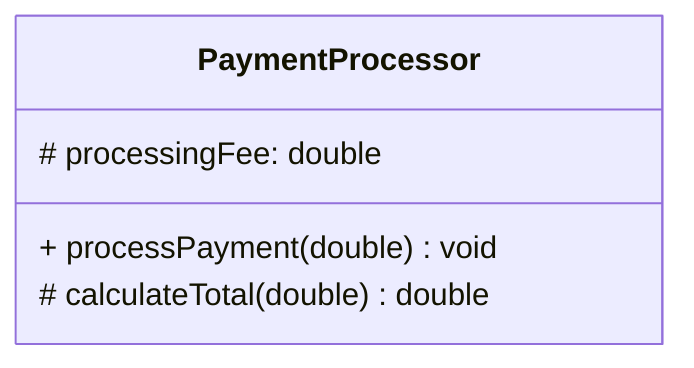
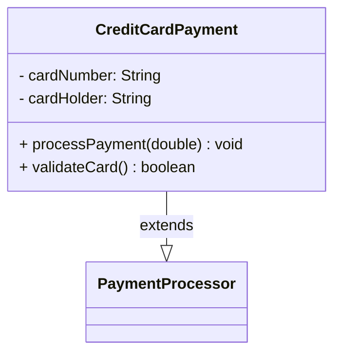
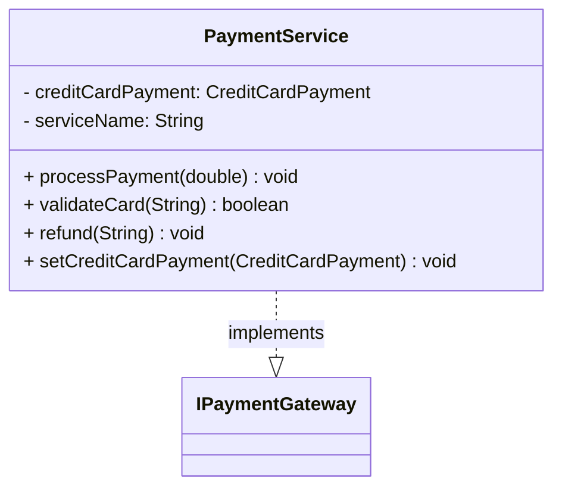

# Phase 3: Diagram Generation - COMPLETE ✅

## What Was Implemented

### 1. **DiagramGenerator Interface** ✅
- Base interface for all diagram generators
- Defines `generate(List<UmlClass>) -> String` contract

### 2. **MermaidGenerator** ✅
- Generates Mermaid class diagram syntax
- Supports:
  - Class, Interface, Enum, Annotation notations
  - Fields with visibility symbols (+ - # ~)
  - Methods with parameters and return types
  - Inheritance relationships (solid arrow: `--|>`)
  - Interface implementation (dashed arrow: `..|>`)

### 3. **PlantUMLGenerator** ✅
- Generates PlantUML class diagram syntax
- Supports:
  - All Mermaid features
  - Additional PlantUML styling options
  - Better formatting with parameter names
  - Professional diagram output

### 4. **Updated Main.java** ✅
- Command-line interface with `--format` option
- Three output modes:
  - `text` - Human-readable (default)
  - `mermaid` - Mermaid class diagram syntax
  - `plantuml` - PlantUML class diagram syntax

### 5. **Helper Scripts** ✅
- `run-uml.ps1` - Text output (Phase 1)
- `run-uml-diagram.ps1` - Diagram output with format selection
- Both support Windows PowerShell

## Generated Diagram Examples

### Mermaid Format

#### Simple Class (PaymentProcessor)


#### Inheritance (CreditCardPayment extends PaymentProcessor)


#### Interface Implementation (PaymentService implements IPaymentGateway)


### Visibility Symbols

| Symbol | Visibility | Usage |
|--------|------------|-------|
| `+` | Public | Public methods/fields |
| `-` | Private | Private fields |
| `#` | Protected | Protected members |
| `~` | Package | Package-private members |

### Relationship Symbols

| Pattern | Meaning | Used For |
|---------|---------|----------|
| `--|>` | Solid arrow | Inheritance (extends) |
| `..\|>` | Dashed arrow | Interface implementation |
| `-->` | Solid line | Dependency/usage |

## Test Results

### Text Format (Default)
```bash
.\run-uml.ps1 src/samples/CreditCardPayment.java
```

Output:
```
Class: CreditCardPayment
Package: com.example
Type: CLASS

Relationships:
  CreditCardPayment extends PaymentProcessor

Fields:
  - cardNumber : String
  - cardHolder : String

Methods:
  + processPayment(amount : double) : void
  + validateCard() : boolean
```

### Mermaid Format
```bash
.\run-uml-diagram.ps1 src/samples/CreditCardPayment.java mermaid
```

Output:
```
classDiagram
    class CreditCardPayment {
        - cardNumber: String
        - cardHolder: String
        + processPayment(double) void
        + validateCard() boolean
    }
    CreditCardPayment --|> PaymentProcessor : extends
```

### PlantUML Format
```bash
.\run-uml-diagram.ps1 src/samples/CreditCardPayment.java plantuml
```

Output:
```
@startuml
!theme plain
skinparam classBackgroundColor #FFFFFF
skinparam classBorderColor #000000

class CreditCardPayment {
    - cardNumber: String
    - cardHolder: String
    --
    + processPayment(amount: double): void
    + validateCard(): boolean
}

CreditCardPayment --|> PaymentProcessor

@enduml
```

## How to Use Diagrams

### In GitHub README
Create a markdown code block with Mermaid diagram:

```markdown
```mermaid
[paste Mermaid output here]
```
```

GitHub will automatically render it!

### In Documentation Tools
- **Notion**: Paste Mermaid diagram in code block
- **Confluence**: Use PlantUML plugin
- **MkDocs**: Native Mermaid support
- **Docusaurus**: Native Mermaid support
- **Obsidian**: Native Mermaid support

### Generate Diagram Files
```powershell
# Save Mermaid diagram to file
.\run-uml-diagram.ps1 src/samples/CreditCardPayment.java mermaid > CreditCardPayment.mmd

# Save PlantUML diagram to file
.\run-uml-diagram.ps1 src/samples/CreditCardPayment.java plantuml > CreditCardPayment.puml
```

## Architecture

```
UML Model (UmlClass, UmlField, UmlMethod, UmlRelationship)
    ↓
DiagramGenerator Interface
    ├─ MermaidGenerator
    └─ PlantUMLGenerator
    ↓
String Output (Diagram Syntax)
    ↓
Renderred in GitHub, Documentation, Tools, etc.
```

## Key Design Patterns

1. **Strategy Pattern**: DiagramGenerator interface allows swapping implementations
2. **Single Responsibility**: Each generator handles one format only
3. **Extensibility**: Easy to add new formats (SQLGenerator, JsonGenerator, etc.)

## Sample Diagrams Generated

All sample diagrams are saved in `samples_diagrams/`:
- `PaymentProcessor.mmd` - Abstract base class
- `CreditCardPayment.mmd` - Class with inheritance
- `IPaymentGateway.mmd` - Interface definition
- `PaymentService.mmd` - Class with interface implementation
- `complete_system.mmd` - Full system diagram with all relationships

## Supported Features

✅ Class, Interface, Enum, Annotation types  
✅ Field visibility (public, private, protected, package)  
✅ Methods with parameters and return types  
✅ Inheritance relationships (extends)  
✅ Interface implementation (implements)  
✅ Multiple output formats (text, Mermaid, PlantUML)  
✅ Command-line interface with format selection  

## Not Yet Implemented

❌ Dependency detection (field type analysis for uses relationships)  
❌ Generic types (List<T>, Map<K,V>)  
❌ Array types  
❌ Nested classes  
❌ Static class members  
❌ Composition classification  
❌ File output (saving diagrams to files automatically)  

## Next Steps

### Option A: Dependency Detection (Recommended)
- Analyze field types to auto-detect "uses" relationships
- Show composition vs association
- Include in diagrams as dependency arrows

### Option B: Enhanced Features
- Support for generics and array types
- Nested class visualization
- Static member notation
- Multiplicity indicators

### Option C: Export Enhancements
- Auto-save diagrams to files
- Batch processing (multiple files at once)
- Diagram customization options (colors, styling)

---
Date: 2026-08-22
Status: Phase 3 Complete - Ready for production use!
