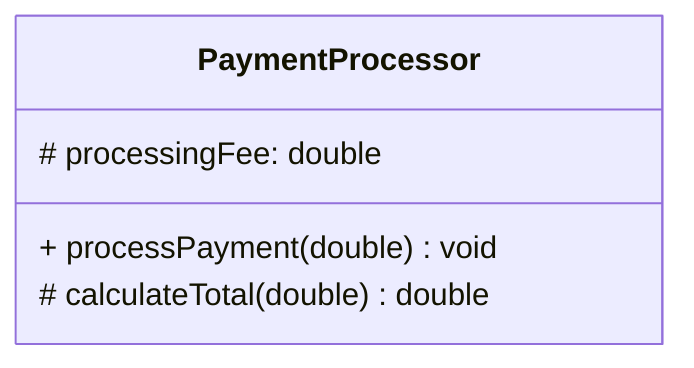
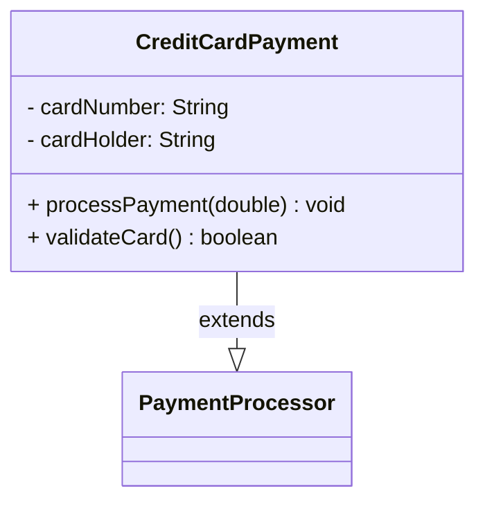
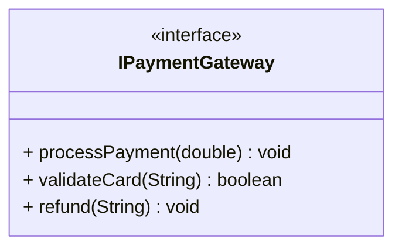
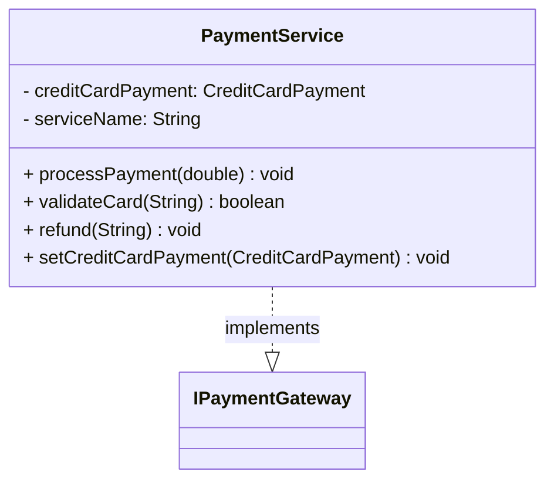
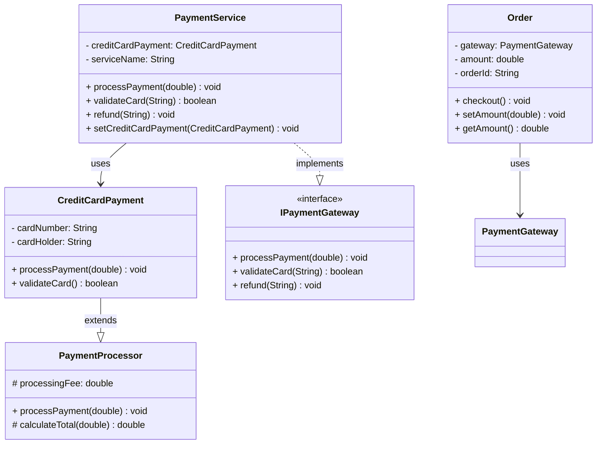
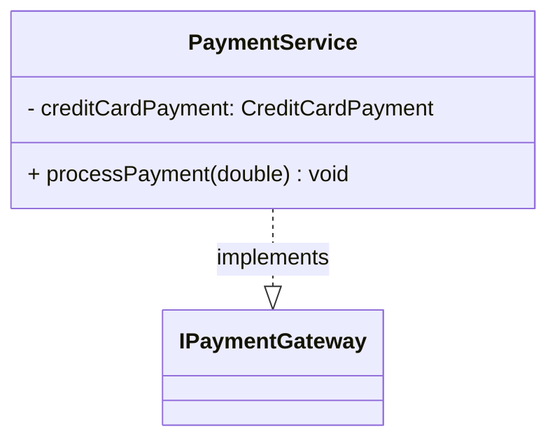

# Sample Diagrams - Java UML Generator

This document shows examples of the diagrams generated by the Java UML Generator.

## 1. Abstract Base Class (PaymentProcessor)

### Input Code
```java
public abstract class PaymentProcessor {
    protected double processingFee;

    public PaymentProcessor(double processingFee) {
        this.processingFee = processingFee;
    }

    public abstract void processPayment(double amount);

    protected double calculateTotal(double amount) {
        return amount + processingFee;
    }
}
```

### Mermaid Diagram


## 2. Inheritance Example (CreditCardPayment extends PaymentProcessor)

### Input Code
```java
public class CreditCardPayment extends PaymentProcessor {
    private String cardNumber;
    private String cardHolder;

    public CreditCardPayment(double processingFee, String cardNumber, String cardHolder) {
        super(processingFee);
        this.cardNumber = cardNumber;
        this.cardHolder = cardHolder;
    }

    @Override
    public void processPayment(double amount) {
        double total = calculateTotal(amount);
        System.out.println("Processing payment of " + total + " from " + cardHolder);
    }

    public boolean validateCard() {
        return cardNumber != null && cardNumber.length() == 16;
    }
}
```

### Mermaid Diagram


**Note**: Solid arrow (`--|>`) represents inheritance relationship.

## 3. Interface Definition (IPaymentGateway)

### Input Code
```java
public interface IPaymentGateway {
    void processPayment(double amount);
    boolean validateCard(String cardNumber);
    void refund(String transactionId);
}
```

### Mermaid Diagram


**Note**: `<<interface>>` notation indicates this is an interface.

## 4. Interface Implementation (PaymentService implements IPaymentGateway)

### Input Code
```java
public class PaymentService implements IPaymentGateway {
    private CreditCardPayment creditCardPayment;
    private String serviceName;

    public PaymentService(String serviceName) {
        this.serviceName = serviceName;
    }

    @Override
    public void processPayment(double amount) {
        if (creditCardPayment != null) {
            creditCardPayment.processPayment(amount);
        }
    }

    @Override
    public boolean validateCard(String cardNumber) {
        return cardNumber != null && cardNumber.length() > 0;
    }

    @Override
    public void refund(String transactionId) {
        System.out.println("Processing refund for transaction: " + transactionId);
    }

    public void setCreditCardPayment(CreditCardPayment creditCardPayment) {
        this.creditCardPayment = creditCardPayment;
    }
}
```

### Mermaid Diagram


**Note**: Dashed arrow (`..|>`) represents interface implementation.

## 5. Complete System Diagram

Shows all classes and their relationships together:



### Legend

| Symbol | Meaning |
|--------|---------|
| `+` | Public |
| `-` | Private |
| `#` | Protected |
| `~` | Package |
| `--|>` | Inheritance (extends) |
| `..\|>` | Implementation (implements) |

## 6. Output Formats Comparison

### Same Class in Different Formats

#### Text Format
```
Class: PaymentService
Package: com.example
Type: CLASS

Relationships:
  PaymentService implements IPaymentGateway

Fields:
  - creditCardPayment : CreditCardPayment
  - serviceName : String

Methods:
  + processPayment(amount : double) : void
  + validateCard(cardNumber : String) : boolean
  + refund(transactionId : String) : void
  + setCreditCardPayment(creditCardPayment : CreditCardPayment) : void
```

#### Mermaid Format
```
classDiagram
    class PaymentService {
        - creditCardPayment: CreditCardPayment
        - serviceName: String
        + processPayment(double) void
        + validateCard(String) boolean
        + refund(String) void
        + setCreditCardPayment(CreditCardPayment) void
    }
    PaymentService ..|> IPaymentGateway : implements
```

#### PlantUML Format
```
@startuml
!theme plain
skinparam classBackgroundColor #FFFFFF
skinparam classBorderColor #000000

class PaymentService {
    - creditCardPayment: CreditCardPayment
    - serviceName: String
    --
    + processPayment(amount: double): void
    + validateCard(cardNumber: String): boolean
    + refund(transactionId: String): void
    + setCreditCardPayment(creditCardPayment: CreditCardPayment): void
}

PaymentService ..|> IPaymentGateway

@enduml
```

## How to Generate These Diagrams

### Text Output
```powershell
.\run-uml.ps1 src/samples/CreditCardPayment.java
```

### Mermaid Output
```powershell
.\run-uml-diagram.ps1 src/samples/CreditCardPayment.java mermaid
```

### PlantUML Output
```powershell
.\run-uml-diagram.ps1 src/samples/CreditCardPayment.java plantuml
```

### Save to File
```powershell
.\run-uml-diagram.ps1 src/samples/CreditCardPayment.java mermaid | Out-File diagram.mmd
.\run-uml-diagram.ps1 src/samples/CreditCardPayment.java plantuml | Out-File diagram.puml
```

## Using in GitHub README

Simply paste Mermaid diagrams into your README.md:

````markdown
## Architecture


````

GitHub will automatically render it! ✨

---

For more information, see [README.md](../README.md)
