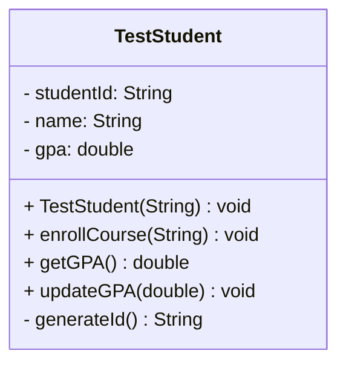
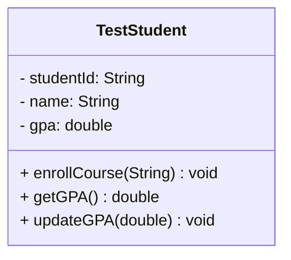

# How to Test Your Own Java File - Complete Guide

## Quick Overview

To test any Java file with the Java UML Generator, you need to:

1. ✅ Have the project built
2. ✅ Have your Java file ready
3. ✅ Run the appropriate command
4. ✅ Get your UML diagram/output

**Total time: 2-3 minutes**

---

## Step-by-Step Instructions

### Step 1: Navigate to Project Directory

```powershell
cd D:\deepak\dev\learning\projects\java-uml-generator
```

### Step 2: Ensure Project is Built

Run this command **once** to build the project:

```powershell
mvn clean compile
```

**What it does**:
- Downloads JavaParser library (first time only)
- Compiles all Java source files
- Creates target/classes directory with compiled code

**Expected output**: 
```
[INFO] BUILD SUCCESS
[INFO] Total time: 3-5 s
```

### Step 3: Prepare Your Java File

You have two options:

#### Option A: Use Sample Files (Quickest)
Sample files are already in `src/samples/`:
- `Order.java`
- `PaymentProcessor.java`
- `CreditCardPayment.java`
- `IPaymentGateway.java`
- `PaymentService.java`

#### Option B: Create Your Own File
Create a file like: `src/samples/MyTestClass.java`

```java
package com.example;

public class MyTestClass {
    private String name;
    private int age;

    public MyTestClass(String name, int age) {
        this.name = name;
        this.age = age;
    }

    public void displayInfo() {
        System.out.println("Name: " + name + ", Age: " + age);
    }

    public String getName() {
        return name;
    }
}
```

### Step 4: Run the Tool

Choose your output format and run the appropriate command:

---

## 📊 Output Format Options

### Option 1: TEXT FORMAT (Default)
Human-readable class information

**Command**:
```powershell
.\run-uml.ps1 <path-to-java-file>
```

**Example**:
```powershell
.\run-uml.ps1 src/samples/Order.java
```

**Sample Output**:
```
Class: Order
Package: com.example
Type: CLASS

Fields:
  - gateway : PaymentGateway
  - amount : double
  - orderId : String

Methods:
  + checkout() : void
  + setAmount(amount : double) : void
  + getAmount() : double
```

---

### Option 2: MERMAID FORMAT (GitHub-Compatible)
Generates UML diagram in Mermaid syntax (renders in GitHub!)

**Command**:
```powershell
.\run-uml-diagram.ps1 <path-to-java-file> mermaid
```

**Example**:
```powershell
.\run-uml-diagram.ps1 src/samples/CreditCardPayment.java mermaid
```

**Sample Output**:
```
classDiagram
    class CreditCardPayment {
        - cardNumber: String
        - cardHolder: String
        + processPayment(double) void
        + validateCard() boolean
    }
    CreditCardPayment --|> PaymentProcessor : extends
```

**How to Use**: Copy and paste into GitHub README:
```markdown
## Class Diagram

```mermaid
[paste output here]
```
```

---

### Option 3: PLANTUML FORMAT (Professional)
Generates UML diagram in PlantUML syntax

**Command**:
```powershell
.\run-uml-diagram.ps1 <path-to-java-file> plantuml
```

**Example**:
```powershell
.\run-uml-diagram.ps1 src/samples/PaymentService.java plantuml
```

**Sample Output**:
```
@startuml
!theme plain
skinparam classBackgroundColor #FFFFFF
skinparam classBorderColor #000000

class PaymentService {
    - creditCardPayment: CreditCardPayment
    - serviceName: String
    --
    + processPayment(amount: double): void
    + validateCard(cardNumber: String): boolean
    + refund(transactionId: String): void
    + setCreditCardPayment(creditCardPayment: CreditCardPayment): void
}

PaymentService ..|> IPaymentGateway

@enduml
```

**How to Use**: Paste into PlantUML editor or documentation tools

---

## 🎯 Common Testing Scenarios

### Scenario 1: Test Simple Class

```powershell
.\run-uml.ps1 src/samples/Order.java
```

**What it detects**:
- ✅ Class name and package
- ✅ All fields with types
- ✅ All methods with parameters

---

### Scenario 2: Test Class with Inheritance

```powershell
.\run-uml-diagram.ps1 src/samples/CreditCardPayment.java mermaid
```

**What it detects**:
- ✅ Class name and package
- ✅ All fields
- ✅ All methods
- ✅ **Inheritance relationship** (extends PaymentProcessor)

**Output includes**:
```
CreditCardPayment --|> PaymentProcessor : extends
```

---

### Scenario 3: Test Interface Implementation

```powershell
.\run-uml-diagram.ps1 src/samples/PaymentService.java mermaid
```

**What it detects**:
- ✅ Class name and package
- ✅ All fields
- ✅ All methods
- ✅ **Interface implementation** (implements IPaymentGateway)

**Output includes**:
```
PaymentService ..|> IPaymentGateway : implements
```

---

### Scenario 4: Test Interface Definition

```powershell
.\run-uml.ps1 src/samples/IPaymentGateway.java
```

**What it detects**:
- ✅ Interface name and package
- ✅ **Interface marker**: `<<interface>>`
- ✅ All method signatures (no implementation)

**Output**:
```
Class: IPaymentGateway
Package: com.example
Type: INTERFACE

Methods:
  + processPayment(amount : double) : void
  + validateCard(cardNumber : String) : boolean
  + refund(transactionId : String) : void
```

---

### Scenario 5: Save Diagram to File

**Mermaid to file**:
```powershell
.\run-uml-diagram.ps1 src/samples/CreditCardPayment.java mermaid | Out-File my-diagram.mmd
```

**PlantUML to file**:
```powershell
.\run-uml-diagram.ps1 src/samples/CreditCardPayment.java plantuml | Out-File my-diagram.puml
```

**Text to file**:
```powershell
.\run-uml.ps1 src/samples/Order.java | Out-File my-class.txt
```

---

## 🔍 What Gets Detected

### Automatically Detected ✅

| Feature | Text | Mermaid | PlantUML |
|---------|------|---------|----------|
| Class name | ✅ | ✅ | ✅ |
| Package | ✅ | ✅ | ✅ |
| Type (class/interface/enum) | ✅ | ✅ | ✅ |
| Private fields (-) | ✅ | ✅ | ✅ |
| Protected fields (#) | ✅ | ✅ | ✅ |
| Public methods (+) | ✅ | ✅ | ✅ |
| Method parameters | ✅ | ✅ | ✅ |
| Return types | ✅ | ✅ | ✅ |
| Inheritance (extends) | ✅ | ✅ | ✅ |
| Interface (implements) | ✅ | ✅ | ✅ |

### NOT Yet Detected ❌

| Feature | Status |
|---------|--------|
| Dependencies (field type analysis) | Phase 4 |
| Generic types (List<T>) | Phase 5 |
| Array types (String[]) | Phase 5 |
| Nested classes | Phase 6 |
| Static members | Phase 5 |

---

## 🎨 Understanding the Output

### Visibility Symbols

```
+ = Public       (public methods/fields)
- = Private      (private fields)
# = Protected    (protected members)
~ = Package      (package-private)
```

**Example**:
```
+ checkout() : void         ← Public method
- amount : double           ← Private field
# processingFee : double    ← Protected field
```

### Relationship Arrows

```
--|>  = Inheritance (extends)
..|>  = Implementation (implements)
```

**Example**:
```
CreditCardPayment --|> PaymentProcessor : extends
PaymentService ..|> IPaymentGateway : implements
```

---

## 📝 Complete Testing Example

### Step 1: Create a Test File

Create `src/samples/TestStudent.java`:

```java
package com.example;

public class TestStudent {
    private String studentId;
    private String name;
    private double gpa;

    public TestStudent(String name) {
        this.name = name;
        this.studentId = generateId();
        this.gpa = 0.0;
    }

    public void enrollCourse(String courseName) {
        System.out.println("Enrolled in " + courseName);
    }

    public double getGPA() {
        return gpa;
    }

    public void updateGPA(double newGPA) {
        this.gpa = newGPA;
    }

    private String generateId() {
        return "STU-" + System.currentTimeMillis();
    }
}
```

### Step 2: Test Text Format

```powershell
.\run-uml.ps1 src/samples/TestStudent.java
```

**Output**:
```
Class: TestStudent
Package: com.example
Type: CLASS

Fields:
  - studentId : String
  - name : String
  - gpa : double

Methods:
  + TestStudent(name : String) : void
  + enrollCourse(courseName : String) : void
  + getGPA() : double
  + updateGPA(newGPA : double) : void
  - generateId() : String
```

### Step 3: Test Mermaid Format

```powershell
.\run-uml-diagram.ps1 src/samples/TestStudent.java mermaid
```

**Output**:


### Step 4: View in GitHub

Save the Mermaid output and use in README.md:

```markdown
## Student Class Diagram


```

---

## ⚠️ Troubleshooting

### Problem: "File not found"

**Error**: `File not found: src/samples/MyFile.java`

**Solution**: 
1. Check the file path is correct
2. Use relative path from project root
3. File must exist before running

```powershell
# Correct way
.\run-uml.ps1 src/samples/Order.java

# Check file exists
Test-Path src/samples/Order.java
```

---

### Problem: "Failed to parse file"

**Error**: `Exception in thread "main" ... Failed to parse file`

**Solution**: 
1. File must be valid Java syntax
2. Check for syntax errors
3. Make sure it's a .java file

---

### Problem: "Class not found" when building

**Error**: `Error: Could not find or load main class`

**Solution**:
1. Run `mvn clean compile` first
2. Make sure target/classes exists
3. Check pom.xml is in project root

---

### Problem: Script not found

**Error**: `.\run-uml.ps1 : The file '...' cannot be found`

**Solution**:
1. Make sure you're in the project root directory
2. Check PowerShell execution policy:
   ```powershell
   Set-ExecutionPolicy -ExecutionPolicy RemoteSigned -Scope CurrentUser
   ```

---

## 🚀 Quick Command Reference

| Task | Command |
|------|---------|
| Build project | `mvn clean compile` |
| Test any Java file (text) | `.\run-uml.ps1 <file>` |
| Test any Java file (Mermaid) | `.\run-uml-diagram.ps1 <file> mermaid` |
| Test any Java file (PlantUML) | `.\run-uml-diagram.ps1 <file> plantuml` |
| Save to file | `.\run-uml-diagram.ps1 <file> mermaid > output.mmd` |
| Test sample file | `.\run-uml.ps1 src/samples/Order.java` |

---

## 📊 Sample Commands to Try Right Now

Copy and paste these into PowerShell:

```powershell
# 1. Test simple class (text)
.\run-uml.ps1 src/samples/Order.java

# 2. Test inheritance (text)
.\run-uml.ps1 src/samples/CreditCardPayment.java

# 3. Test interface (text)
.\run-uml.ps1 src/samples/IPaymentGateway.java

# 4. Test interface implementation (text)
.\run-uml.ps1 src/samples/PaymentService.java

# 5. Same as #2 but Mermaid format
.\run-uml-diagram.ps1 src/samples/CreditCardPayment.java mermaid

# 6. Same as #4 but Mermaid format
.\run-uml-diagram.ps1 src/samples/PaymentService.java mermaid

# 7. PlantUML format
.\run-uml-diagram.ps1 src/samples/CreditCardPayment.java plantuml
```

---

## 💡 Pro Tips

### Tip 1: Multiple Files at Once
```powershell
Get-ChildItem src/samples/*.java | ForEach-Object {
    Write-Host "=== $($_.Name) ==="
    & .\run-uml.ps1 $_.FullName
}
```

### Tip 2: Save All Diagrams
```powershell
Get-ChildItem src/samples/*.java | ForEach-Object {
    $name = $_.BaseName
    & .\run-uml-diagram.ps1 $_.FullName mermaid | Out-File "samples_diagrams/$name.mmd"
}
```

### Tip 3: Check if Build is Needed
```powershell
# Check if compiled files exist
Test-Path target/classes/com/deepak/uml/Main.class
# If False, run: mvn clean compile
```

### Tip 4: Pipe to Less for Large Output
```powershell
.\run-uml.ps1 src/samples/PaymentService.java | less
```

---

## 📚 Next Steps

After testing your file:

1. **If it worked**: Copy Mermaid output to your GitHub README!
2. **If you found issues**: Check the syntax of your Java file
3. **If you want more features**: Refer to PHASE2_SUMMARY.md and PHASE3_SUMMARY.md

---

## ✅ Success Checklist

- [ ] Project is built (`mvn clean compile` succeeded)
- [ ] Your Java file is ready
- [ ] You ran one of the commands
- [ ] You got output (text, Mermaid, or PlantUML)
- [ ] Output shows your class information correctly

**If all checked ✅ - You're done! The tool is working!** 🎉

---

**Quick Summary**:
1. Navigate to project folder
2. Run `mvn clean compile` (first time only)
3. Run `.\run-uml.ps1 <your-file.java>` for text
4. Or run `.\run-uml-diagram.ps1 <your-file.java> mermaid` for diagram
5. See your UML output instantly!

That's it! 🚀
